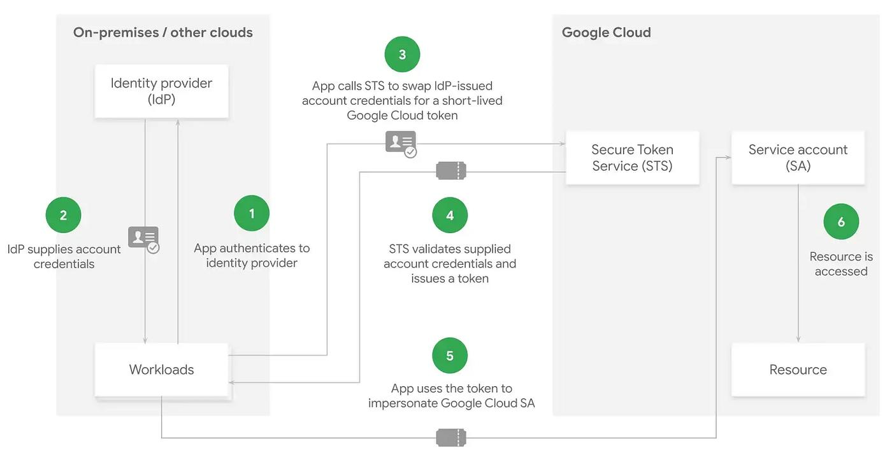

# Google Cloud Workload Identity Federation Authentication PoCs

## Purpose

This repository contains a collection of **Proofs of Concept (PoCs)** demonstrating **secretless authentication** to Google Cloud Platform (GCP) using **Workload Identity Federation (WIF)**.

The goal is to eliminate the need for long-lived Service Account JSON keys (`service-account.json`) by replacing them with trusted workload identities that are exchanged for temporary Google access tokens through Google Security Token Service (STS).

This repository currently demonstrates two federation approaches:

- **SPIFFE/SPIRE + OIDC (JWT-SVID)**
- **X.509 Mutual TLS (mTLS)**

---

## Common Workload Identity Federation Flow

Both implementations ultimately follow the same high-level authentication flow.



Regardless of the workload identity mechanism, the authentication process follows these stages:

1. The workload authenticates to an external Identity Provider.
2. The Identity Provider issues a trusted workload identity (JWT or X.509 certificate).
3. Google Application Default Credentials (ADC) presents that identity to Google Security Token Service (STS).
4. Google validates the workload identity using the configured Workload Identity Provider.
5. Google impersonates the configured IAM Service Account.
6. Temporary Google credentials are returned.
7. The application accesses Google Cloud services (Firestore, Cloud Storage, etc.).

---

## Repository Structure

```text
gcp-secretless-auth-pocs/
│
├── README.md
├── images/
│   └── wif-common-flow.png
│
├── spiffe-oidc-poc/
│   ├── docker-compose.yml
│   ├── server.conf
│   ├── agent.conf
│   ├── helper.conf
│   ├── main.go
│   ├── shared-credentials/
│   └── README.md
│
└── x509-mtls-poc/
    ├── cert_config.cnf
    ├── main.go
    └── README.md
```

---

## Implemented PoCs

### 1. SPIFFE/SPIRE + OIDC

Implements dynamic workload identity using **SPIFFE/SPIRE**.

**Highlights**

- JWT-SVID workload identities
- OIDC-based Workload Identity Federation
- Automatic identity rotation
- Sidecar architecture using SPIFFE Helper
- Workload Attestation and Node Attestation

For implementation details, see:

**[`spiffe-oidc-poc/README.md`](./spiffe-oidc-poc/README.md)

---

### 2. X.509 Mutual TLS

Implements workload identity using **X.509 client certificates**.

This PoC simulates an enterprise PKI where workload certificates are issued by a trusted Certificate Authority (CA) and federated with Google Cloud through the X.509 Workload Identity Provider.

**Highlights**

- Mutual TLS authentication
- Enterprise PKI simulation
- Google X.509 Workload Identity Federation
- Service Account Impersonation
- No sidecars or agents required

For implementation details, see:

**[`x509-mtls-poc/README.md`](./x509-mtls-poc/README.md)

---

## Architecture Comparison

| Feature | SPIFFE/SPIRE | X.509 mTLS |
|---------|--------------|------------|
| Workload Identity | JWT-SVID | X.509 Certificate |
| Federation Protocol | OIDC | Mutual TLS |
| Trust Anchor | SPIRE Server | Enterprise PKI |
| Identity Rotation | Automatic | PKI-managed |
| Runtime Component | SPIRE Agent + SPIFFE Helper | None |
| Workload Verification | Workload Attestation | Certificate Ownership |
| Best Fit | Cloud-native workloads | Enterprise & legacy infrastructure |

---

## Prerequisites

Both PoCs assume access to the following:

- Go
- Google Cloud SDK (`gcloud`)
- A Google Cloud project
- Firebase / Firestore
- Workload Identity Federation configured in GCP

Additional requirements:

| PoC | Additional Requirements |
|------|-------------------------|
| SPIFFE/SPIRE | Docker & Docker Compose |
| X.509 mTLS | OpenSSL |

---

## Repository Guide

If you are new to this repository, the recommended reading order is:

1. Read this README to understand the overall architecture.
2. Choose one authentication approach:
   - SPIFFE/SPIRE + OIDC
   - X.509 Mutual TLS
3. Follow the corresponding implementation guide:
   - [`spiffe-oidc-poc/README.md`](./spiffe-oidc-poc/README.md)
   - [`x509-mtls-poc/README.md`](./x509-mtls-poc/README.md)

---

## References
-   [Google Cloud Workload Identity Federation with X.509 Certificates](https://docs.cloud.google.com/iam/docs/workload-identity-federation-with-x509-certificates)
    
-   [SPIRE Architecture & Concepts Documentation](https://spiffe.io/docs/latest/spire-about/spire-concepts/)

