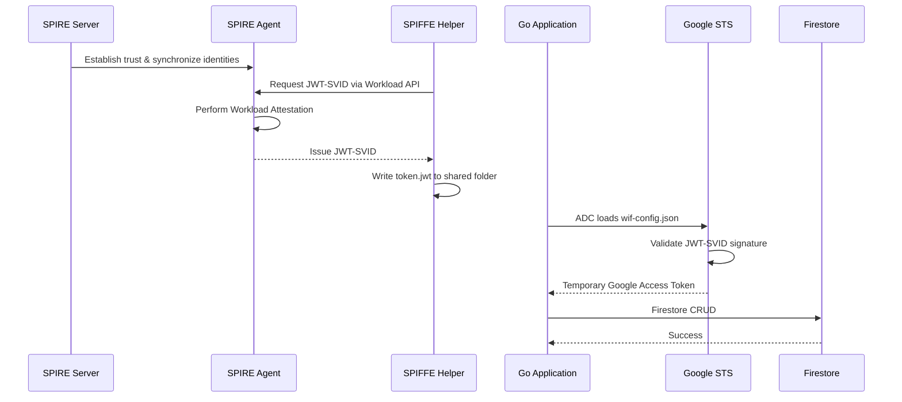

# SPIFFE/SPIRE + Google Cloud Workload Identity Federation (OIDC) PoC

## Purpose

This repository demonstrates a **Zero-Trust authentication architecture** using **SPIFFE/SPIRE** as an external identity provider for **Google Cloud Workload Identity Federation (WIF)**.

The objective of this Proof of Concept (PoC) is to show how a Go application can securely authenticate to Google Cloud **without storing a long-lived Service Account JSON key (`service-account.json`)**.

Instead, authentication is performed using:

- SPIFFE/SPIRE for workload identity
- JWT-SVID (short-lived workload identity token)
- Google Workload Identity Federation (OIDC)
- Service Account Impersonation
- Google Application Default Credentials (ADC)

This results in a **secretless authentication flow**, where Google credentials are generated dynamically and automatically rotated.

---

## Architecture Overview

This PoC follows the **Sidecar Pattern**.

The Go application contains **zero SPIFFE- or Google-specific authentication logic**.

Instead:

- SPIRE manages workload identities.
- SPIFFE Helper continuously exports short-lived JWT-SVIDs.
- Google Application Default Credentials (ADC) transparently exchanges those identities with Google Security Token Service (STS).
- Firebase Admin SDK automatically receives temporary Google credentials.

The application simply uses the standard Firebase Admin SDK.

---

## High-Level Architecture

```text
                    +----------------------+
                    |    SPIRE Server      |
                    | Central Trust Anchor |
                    +----------+-----------+
                               ^
                     Node Attestation
                               |
                     mTLS Connection
                               |
                    +----------+-----------+
                    |     SPIRE Agent      |
                    |   (One per VM/Node)  |
                    +----------+-----------+
                               |
                 Workload Attestation
                               |
                    JWT-SVID Issued
                               |
                    +----------+-----------+
                    |    SPIFFE Helper     |
                    |   (Sidecar Process)  |
                    +----------+-----------+
                               |
                         token.jwt
                               |
                     Google ADC + WIF
                               |
              Google Security Token Service
                               |
               Service Account Impersonation
                               |
                  Firebase Admin SDK (Go)
                               |
                           Firestore
```

---

## Authentication Flow



---

## Authentication Summary

The authentication process consists of the following stages:

1. SPIRE Agent authenticates itself to the SPIRE Server (Node Attestation).
2. SPIRE Server authorizes the node and establishes trust.
3. SPIFFE Helper requests a workload identity from the local SPIRE Agent.
4. SPIRE Agent performs Workload Attestation.
5. SPIRE Server issues a short-lived JWT-SVID.
6. SPIFFE Helper continuously writes the JWT-SVID (`token.jwt`) to disk.
7. Google Application Default Credentials (ADC) reads `wif-config.json`.
8. Google STS validates the JWT-SVID against the configured Workload Identity Provider.
9. Google impersonates the configured Service Account.
10. Firebase Admin SDK automatically authenticates every Firestore request.

---

## Project Structure

```text
.
├── docker-compose.yml
├── server.conf
├── agent.conf
├── helper.conf
├── main.go
├── wif-config.json
├── shared-credentials/
│   ├── token.jwt
│   ├── svid.pem
│   ├── svid_key.pem
│   └── svid_bundle.pem
└── README.md
```

| File | Purpose |
|------|---------|
| `docker-compose.yml` | Deploys the SPIRE Server, SPIRE Agent, and SPIFFE Helper. |
| `server.conf` | Configures the SPIRE Server (trust domain, datastore, signing keys). |
| `agent.conf` | Configures the SPIRE Agent and Workload API socket. |
| `helper.conf` | Configures SPIFFE Helper to export JWT-SVIDs and X.509-SVIDs. |
| `main.go` | Example Go application using Firebase Admin SDK. |
| `shared-credentials/` | Stores generated identities (`token.jwt`, X.509-SVIDs). |
| `wif-config.json` | Google ADC configuration generated by `gcloud`. |

---

# Running the PoC

## Step 1 — Start SPIRE Infrastructure

```bash
docker compose up -d
```

This starts:

- SPIRE Server
- SPIRE Agent
- SPIFFE Helper

---

## Step 2 — Register the Workload

SPIRE follows a **default-deny** security model.

No workload receives an identity unless an explicit **Registration Entry** exists.

Create one using:

```bash
docker exec -it spire-server bin/spire-server entry create \
-spiffeID spiffe://poc.local/go-app \
-parentID spiffe://poc.local/spire-agent \
-selector unix:user:root \
-audience gcp-wif
```

Once registered, SPIFFE Helper will automatically export:

```text
shared-credentials/token.jwt
```

---

## Step 3 — Configure Google Workload Identity Federation

Generate the ADC configuration file.

```bash
gcloud iam workload-identity-pools create-cred-config \
projects/YOUR_PROJECT_NUMBER/locations/global/workloadIdentityPools/YOUR_POOL/providers/YOUR_PROVIDER \
--service-account="spire-firestore-poc@YOUR_PROJECT_ID.iam.gserviceaccount.com" \
--executable-command="cat $(pwd)/shared-credentials/token.jwt" \
--executable-timeout-millis=30000 \
--output-file="wif-config.json"
```

This file tells Google Application Default Credentials:

- Where to obtain the external JWT
- Which Workload Identity Provider to use
- Which Service Account to impersonate

---

## Step 4 — Run the Application

Point ADC to the generated configuration.

```bash
export GOOGLE_APPLICATION_CREDENTIALS="$(pwd)/wif-config.json"

go run main.go
```

Expected output:

```text
Attempting to write to Firestore using SPIFFE identity...

✅ Success! Document written with ID: xxxxxxxxxxxxx

🎉 The PoC is complete! Zero static secrets were used.
```

---

## How Google Authentication Works

The Go application contains **no SPIFFE code**.

Calling:

```go
firebase.NewApp(...)
```

automatically triggers:

```text
firebase.NewApp()
│
Application Default Credentials
│
GOOGLE_APPLICATION_CREDENTIALS
│
wif-config.json
│
Read token.jwt
│
Google Security Token Service
│
Service Account Impersonation
│
Temporary OAuth Access Token
│
Firestore
```

All authentication occurs transparently beneath the Firebase Admin SDK.

---

## Security Benefits

Compared to a traditional Service Account JSON key:

- No long-lived Google credentials
- Short-lived JWT-SVIDs
- Temporary Google OAuth tokens
- Automatic credential rotation
- Service Account Impersonation
- Workload identity verified before every federation exchange

---

## Production Considerations

This repository intentionally simplifies several aspects to make learning easier.

| PoC | Production |
|------|------------|
| Docker Compose | Virtual Machines / Kubernetes |
| SQLite datastore | PostgreSQL datastore |
| Join Token Node Attestation | Cloud Attestation / TPM / Secure Node Attestors |
| `insecure_bootstrap=true` | Secure Trust Bundle Distribution |
| Single SPIRE Server | Highly Available SPIRE Cluster |
| Local shared folder | Secure filesystem / Workload API |

---

## Limitations

This repository is designed for educational purposes.

It intentionally omits:

- High Availability
- Production-grade Node Attestation
- Certificate rotation
- Secure Trust Bundle distribution
- PostgreSQL datastore
- TLS hardening
- Monitoring and observability

---

## Key Takeaways

After completing this PoC, you should understand:

- What SPIFFE and SPIRE are
- The difference between Node Attestation and Workload Attestation
- How JWT-SVIDs are generated
- How Google Workload Identity Federation works
- How Google STS exchanges external identities
- How Service Account Impersonation works
- How Application Default Credentials (ADC) hides authentication complexity
- How Firebase Admin SDK authenticates without storing Service Account JSON keys

---

## References

- SPIFFE Specification
- SPIRE Documentation
- Google Cloud Workload Identity Federation
- Google Security Token Service (STS)
- Firebase Admin SDK