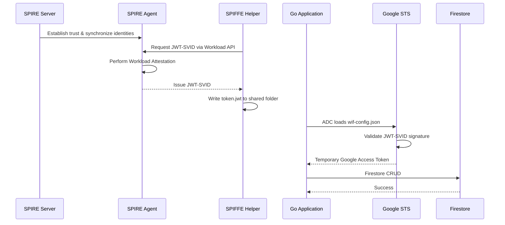

# SPIFFE/SPIRE + Google Cloud Workload Identity Federation (OIDC) PoC

## Purpose

This repository demonstrates a **Zero-Trust authentication architecture** using **SPIFFE/SPIRE** as an external identity provider for **Google Cloud Workload Identity Federation (WIF)**.

The objective of this Proof of Concept (PoC) is to show how a Go application can securely authenticate to Google Cloud **without storing a long-lived Service Account JSON key (`service-account.json`)**.

Instead, authentication is performed using:

- SPIFFE/SPIRE for workload identity
- JWT-SVID (short-lived workload identity token)
- Google Workload Identity Federation (OIDC)
- Service Account Impersonation
- Google Application Default Credentials (ADC)

This results in a **secretless authentication flow**, where Google credentials are generated dynamically and automatically rotated.

---

<details>
<summary><strong>Executive Summary</strong></summary>

## Architecture Overview

This PoC follows the **Sidecar Pattern**.

The Go application contains **zero SPIFFE- or Google-specific authentication logic**.

Instead:

- SPIRE manages workload identities.
- SPIFFE Helper continuously exports short-lived JWT-SVIDs.
- Google Application Default Credentials (ADC) transparently exchanges those identities with Google Security Token Service (STS).
- Firebase Admin SDK automatically receives temporary Google credentials.

The application simply uses the standard Firebase Admin SDK.

---

## High-Level Architecture

```text
                    +----------------------+
                    |    SPIRE Server      |
                    | Central Trust Anchor |
                    +----------+-----------+
                               ^
                     Node Attestation
                               |
                     mTLS Connection
                               |
                    +----------+-----------+
                    |     SPIRE Agent      |
                    |   (One per VM/Node)  |
                    +----------+-----------+
                               |
                 Workload Attestation
                               |
                    JWT-SVID Issued
                               |
                    +----------+-----------+
                    |    SPIFFE Helper     |
                    |   (Sidecar Process)  |
                    +----------+-----------+
                               |
                         token.jwt
                               |
                     Google ADC + WIF
                               |
              Google Security Token Service
                               |
               Service Account Impersonation
                               |
                  Firebase Admin SDK (Go)
                               |
                           Firestore
```

---

## Authentication Flow



---

## Authentication Summary

The authentication process consists of the following stages:

1. SPIRE Agent authenticates itself to the SPIRE Server (Node Attestation).
2. SPIRE Server authorizes the node and establishes trust.
3. SPIFFE Helper requests a workload identity from the local SPIRE Agent.
4. SPIRE Agent performs Workload Attestation.
5. SPIRE Server issues a short-lived JWT-SVID.
6. SPIFFE Helper continuously writes the JWT-SVID (`token.jwt`) to disk.
7. Google Application Default Credentials (ADC) reads `wif-config.json`.
8. Google STS validates the JWT-SVID against the configured Workload Identity Provider.
9. Google impersonates the configured Service Account.
10. Firebase Admin SDK automatically authenticates every Firestore request.

---
## Security Benefits

Compared to a traditional Service Account JSON key:

- No long-lived Google credentials
- Short-lived JWT-SVIDs
- Temporary Google OAuth tokens
- Automatic credential rotation
- Service Account Impersonation
- Workload identity verified before every federation exchange

---

## Project Structure

```text
.
├── docker-compose.yml
├── server.conf
├── agent.conf
├── helper.conf
├── main.go
├── wif-config.json
├── shared-credentials/
│   ├── token.jwt
│   ├── svid.pem
│   ├── svid_key.pem
│   └── svid_bundle.pem
└── README.md
```

| File | Purpose |
|------|---------|
| `docker-compose.yml` | Deploys the SPIRE Server, SPIRE Agent, and SPIFFE Helper. |
| `server.conf` | Configures the SPIRE Server (trust domain, datastore, signing keys). |
| `agent.conf` | Configures the SPIRE Agent and Workload API socket. |
| `helper.conf` | Configures SPIFFE Helper to export JWT-SVIDs and X.509-SVIDs. |
| `main.go` | Example Go application using Firebase Admin SDK. |
| `shared-credentials/` | Stores generated identities (`token.jwt`, X.509-SVIDs). |
| `wif-config.json` | Google ADC configuration generated by `gcloud`. |

---

</details>

<details>
<summary><strong>Running the PoC</strong></summary>

## Step 1 — Start SPIRE Infrastructure

```bash
docker compose up -d
```

This starts:

- SPIRE Server
- SPIRE Agent
- SPIFFE Helper

---

## Step 2 — Register the Workload

SPIRE follows a **default-deny** security model.

No workload receives an identity unless an explicit **Registration Entry** exists.

Create one using:

```bash
docker exec -it spire-server bin/spire-server entry create \
-spiffeID spiffe://poc.local/go-app \
-parentID spiffe://poc.local/spire-agent \
-selector unix:user:root \
-audience gcp-wif
```

Once registered, SPIFFE Helper will automatically export:

```text
shared-credentials/token.jwt
```

---

## Step 3 — Configure Google Workload Identity Federation

Generate the ADC configuration file.

```bash
gcloud iam workload-identity-pools create-cred-config \
projects/YOUR_PROJECT_NUMBER/locations/global/workloadIdentityPools/YOUR_POOL/providers/YOUR_PROVIDER \
--service-account="spire-firestore-poc@YOUR_PROJECT_ID.iam.gserviceaccount.com" \
--executable-command="cat $(pwd)/shared-credentials/token.jwt" \
--executable-timeout-millis=30000 \
--output-file="wif-config.json"
```

This file tells Google Application Default Credentials:

- Where to obtain the external JWT
- Which Workload Identity Provider to use
- Which Service Account to impersonate

---

## Step 4 — Run the Application

Point ADC to the generated configuration.

```bash
export GOOGLE_APPLICATION_CREDENTIALS="$(pwd)/wif-config.json"

go run main.go
```

Expected output:

```text
Attempting to write to Firestore using SPIFFE identity...

✅ Success! Document written with ID: xxxxxxxxxxxxx

🎉 The PoC is complete! Zero static secrets were used.
```

---

## How Google Authentication Works

The Go application contains **no SPIFFE code**.

Calling:

```go
firebase.NewApp(...)
```

automatically triggers:

```text
firebase.NewApp()
│
Application Default Credentials
│
GOOGLE_APPLICATION_CREDENTIALS
│
wif-config.json
│
Read token.jwt
│
Google Security Token Service
│
Service Account Impersonation
│
Temporary OAuth Access Token
│
Firestore
```

All authentication occurs transparently beneath the Firebase Admin SDK.

---

</details>

<details>
<summary><strong>Infrastructure Deployment & Operational Guide</strong></summary>
This section provides a high-level overview of the infrastructure required to deploy a production SPIFFE/SPIRE environment integrated with Google Cloud Workload Identity Federation (WIF).

Unlike the PoC presented in this repository, a production deployment requires additional infrastructure components such as secure node attestation, highly available SPIRE servers, persistent storage, and automated workload registration.

---

## Step 1 — Deploy the SPIRE Server

The SPIRE Server is the central trust authority of the environment.

Its responsibilities include:

- Maintaining the trust domain
- Managing workload registration entries
- Performing Node Attestation
- Issuing workload identities (JWT-SVIDs and X.509-SVIDs)
- Publishing the trust bundle used to verify issued identities

Typical configuration tasks include:

- Configure the trust domain
- Configure persistent datastore (PostgreSQL recommended)
- Configure signing keys
- Configure the JWT issuer
- Configure Node Attestor plugins
- Configure Workload Attestor plugins

Start the server:

```bash
spire-server run -config /etc/spire/server.conf
```

Verify the server is healthy:

```bash
spire-server healthcheck
```

---

## Step 2 — Deploy SPIRE Agents

A SPIRE Agent must be deployed on **every workload host (VM or node)**.

The Agent acts as the local identity authority for workloads running on that machine.

Responsibilities include:

- Performing Node Attestation with the SPIRE Server
- Receiving the Trust Bundle
- Hosting the Workload API socket
- Performing Workload Attestation
- Requesting workload identities from the SPIRE Server

Typical configuration includes:

- SPIRE Server endpoint
- Trust domain
- Local Workload API socket
- Node Attestor plugin
- Workload Attestor plugin

---

## Step 3 — Configure Node Attestation

Before an Agent can participate in the trust domain, it must prove the identity of the machine it is running on.

This process is known as **Node Attestation**.

The attestation mechanism depends on the deployment platform.

Examples include:

| Platform | Recommended Node Attestor |
|----------|---------------------------|
| AWS | aws_iid |
| Azure | azure_msi |
| Google Cloud | gcp_iit |
| Bare-metal | TPM |
| Local Development | Join Token |

Only after successful node attestation will the SPIRE Server trust the Agent and allow workload identities to be issued.

---


### Local Development (Join Token)

For local testing and PoCs, the simplest Node Attestation mechanism is a **Join Token**.

Generate a one-time join token on the SPIRE Server:

```bash
spire-server token generate \
  -spiffeID spiffe://poc.local/spire-agent
```

The command returns a UUID token.

Boot the SPIRE Agent using that token:

```bash
spire-agent run \
  -config /etc/spire/agent.conf \
  -joinToken <GENERATED_TOKEN>
```

Verify the Agent successfully joined the trust domain:

```bash
spire-agent healthcheck
```

> **Note**
>
> Join Tokens are intended only for development or controlled bootstrap scenarios.
> Production deployments should use platform-specific Node Attestors instead.

---


### Example Production Node Attestation (AWS)

For AWS deployments, SPIRE can automatically verify EC2 instances using the **AWS Instance Identity Document (IID)**. Unlike the PoC, no bootstrap join token is required. Instead, the SPIRE Agent presents the cryptographically signed instance identity document provided by AWS, allowing the SPIRE Server to verify that the workload is running on a genuine EC2 instance.

#### 1. Enable the AWS IID Node Attestor

Configure the SPIRE Server to load the AWS IID Node Attestor plugin.

```hcl
NodeAttestor "aws_iid" {
    plugin_data {
        regions = ["ap-southeast-1"]
    }
}
```

#### 2. Define Which Nodes Are Trusted

Loading the plugin alone is **not sufficient**. You must explicitly define which EC2 instances are allowed to join the SPIRE trust domain by creating a registration entry.

For example, authorize any EC2 instance running in a specific AWS account and region:

```bash
spire-server entry create \
    -spiffeID spiffe://poc.local/spire-agent \
    -selector aws_iid:account_id:123456789012 \
    -selector aws_iid:region:ap-southeast-1
```

This registration entry acts as the authorization policy for node attestation. During startup, the SPIRE Server verifies the instance's identity document and only allows the agent to join if its attributes match the configured selectors.

#### 3. Boot the SPIRE Agent

Since authentication is performed using the EC2 Instance Identity Document, no join token is required.

```bash
spire-agent run -config /etc/spire/agent.conf
```

The SPIRE Agent automatically retrieves its EC2 Instance Identity Document, sends it to the SPIRE Server, and—if the configured selectors match the registration entry—is successfully admitted into the SPIFFE trust domain.

---

## Step 3 — Register Workloads

SPIRE follows a **default-deny** security model.

Every workload must be explicitly authorized before an identity will be issued.

Authorization is defined using **Registration Entries**.

Each registration entry specifies:

- Parent SPIFFE ID
- Workload SPIFFE ID
- Workload selectors
- Optional JWT audiences

Example:

```bash
spire-server entry create \
  -parentID spiffe://poc.local/spire-agent \
  -spiffeID spiffe://poc.local/go-app \
  -selector unix:user:root \
  -audience gcp-wif
```

During runtime, the SPIRE Agent compares the running process against the configured selectors.

If the selectors match, the workload receives its identity.

---

## Step 4 — Export the JWKS

Google Cloud must be able to verify JWT-SVID signatures issued by SPIRE.

This is accomplished by publishing the SPIRE Server's **JSON Web Key Set (JWKS)**.

Export the public signing keys:

```bash
spire-server bundle show -format jwks > jwks.json
```

The exported file contains **only public keys**.

It is uploaded to the Google Cloud Workload Identity Provider and allows Google Security Token Service (STS) to verify incoming JWT-SVID signatures.

No private signing keys are exposed.

---

## Step 5 — Configure Google Workload Identity Federation

Google Cloud must be configured to trust identities issued by SPIRE.

Configuration consists of:

- Creating a Workload Identity Pool
- Creating an OIDC Provider
- Uploading the exported JWKS
- Configuring IAM attribute mappings
- Granting Service Account impersonation permissions

---

## Step 6 — Generate ADC Configuration

Google Application Default Credentials (ADC) requires a credential configuration describing:

- the Workload Identity Provider
- the Service Account to impersonate
- how to retrieve the external JWT

Generate the configuration:

```bash
gcloud iam workload-identity-pools create-cred-config \
  projects/PROJECT_NUMBER/locations/global/workloadIdentityPools/POOL/providers/PROVIDER \
  --service-account=SERVICE_ACCOUNT_EMAIL \
  --output-file=wif-config.json
```

This file is **not a secret**.

It only instructs ADC how to perform federation.

---

## Step 7 — Deploy SPIFFE Helper (Optional)

Applications can communicate directly with the SPIRE Workload API.

However, doing so requires application code to integrate with SPIRE's gRPC APIs.

This PoC instead adopts the **SPIFFE Helper sidecar pattern**.

Responsibilities include:

- Connecting to the Workload API socket
- Requesting JWT-SVIDs
- Writing identities to disk
- Automatically refreshing identities before expiration

This allows applications to remain completely unaware of SPIFFE.

The application simply consumes the exported `token.jwt`.

---

## Step 8 — Execute the Application

Once the infrastructure is operational:

1. SPIRE issues workload identities.
2. SPIFFE Helper continuously refreshes `token.jwt`.
3. ADC loads `wif-config.json`.
4. Google STS exchanges the JWT-SVID.
5. Google impersonates the configured Service Account.
6. Firebase Admin SDK automatically authenticates API requests.

Run the application:

```bash
export GOOGLE_APPLICATION_CREDENTIALS="wif-config.json"

go run main.go
```

---

## Registration Management Commands

List all registration entries:

```bash
spire-server entry show
```

View a specific workload:

```bash
spire-server entry show \
  -spiffeID spiffe://poc.local/go-app
```

Delete a registration entry:

```bash
spire-server entry delete \
  -entryID <ENTRY_UUID>
```

---

## Production Considerations

Compared to this PoC, a production deployment would typically include:

- Highly available SPIRE Servers
- PostgreSQL datastore
- Secure Node Attestation
- Automated workload registration
- Secure Trust Bundle distribution
- TLS hardening
- Monitoring and alerting
- Backup and disaster recovery
- Automated SPIRE upgrades

The PoC intentionally minimizes these operational concerns to focus on demonstrating the authentication architecture and federation workflow.

</details>